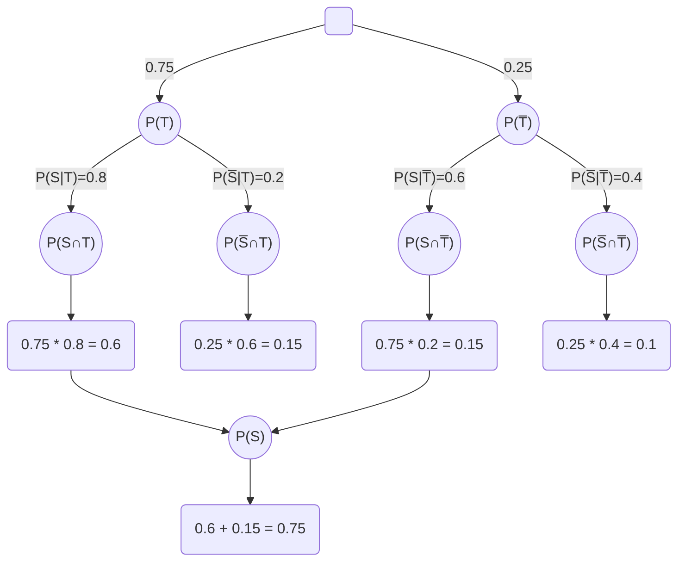

```mermaid
%% If you see this code instead of an image, please add this extension to your browser, such as:
%% https://chrome.google.com/webstore/detail/markdown-diagrams/pmoglnmodacnbbofbgcagndelmgaclel
graph TB;
	start( )
	start--> |"0.75"| T(("P(T)"))
	start--> |"0.25"| t(("P(T̅)"))
	T--> |"P(S|T)=0.8"| ST(("P(S&cap;T)"))
	T--> |"P(S̅|T)=0.2"| sT(("P(S̅&cap;T)"))
	t--> |"P(S|T̅)=0.6"| St(("P(S&cap;T̅)"))
	t--> |"P(S̅|T̅)=0.4"| st(("P(S̅&cap;T̅)"))
	ST-->STAnswer(0.75 * 0.8 = 0.6)
	St-->StAnswer(0.75 * 0.2 = 0.15)
	sT-->sTAnswer(0.25 * 0.6 = 0.15)
	st-->stAnswer(0.25 * 0.4 = 0.1)
	STAnswer-->S(("P(S)"))
	StAnswer-->S
	S-->SAnswer("0.6 + 0.15 = 0.75")
```